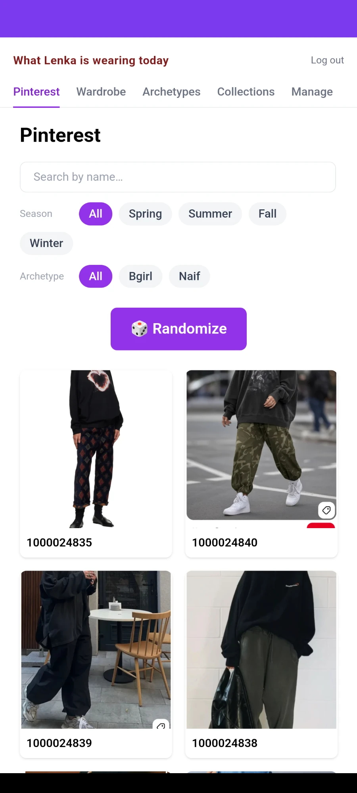
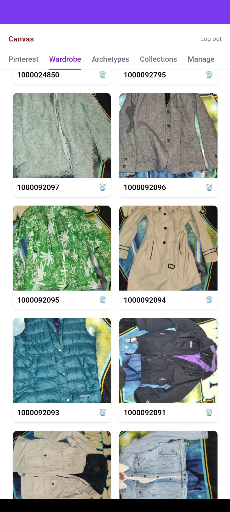
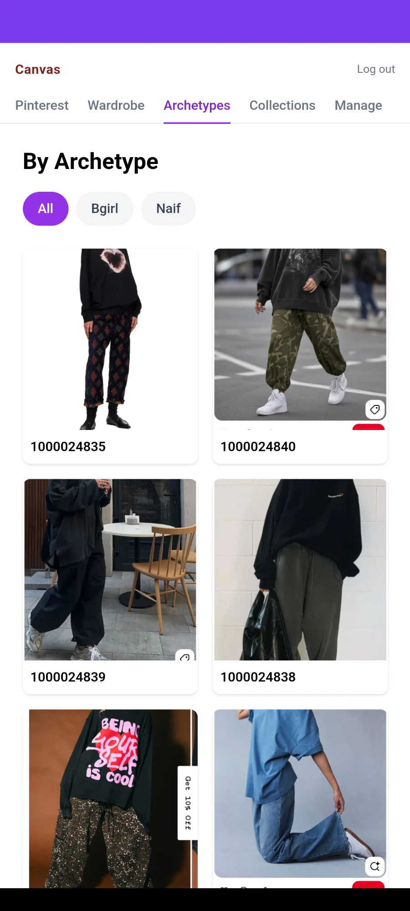
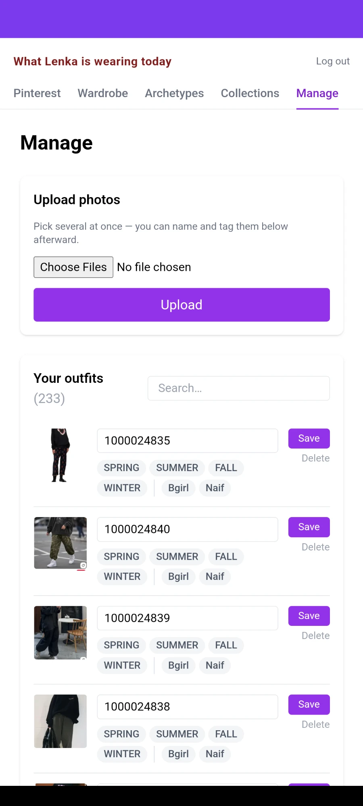

# Canvas 👗

A full-stack personal **wardrobe & style board** — think Pinterest, but for your own closet. Upload photos of your outfits and saved inspiration, name and tag them by season and archetype, group them into collections, link looks to the physical garments in your wardrobe, and shuffle for outfit ideas. Installable on your phone as a PWA.

**Live app:** https://canvas-psi-two-82.vercel.app

This repository is the **React frontend**. The backend (Spring Boot REST API) runs as a separate service.

---

## Screenshots

| | |
|:---:|:---:|
| <br/>**Pinterest** — browse, search & filter, or shuffle for a random look | <br/>**Wardrobe** — your physical clothing pieces |
| <br/>**Archetypes** — filter outfits by style (Bgirl / Naif) | <br/>**Manage** — bulk upload, name & tag outfits |

---

## Tech stack

**Frontend (this repo)**
- **React 18** + **TypeScript** (Create React App)
- **Tailwind CSS 3** for styling
- **React Router v7** for routing
- **PWA** — web app manifest + service worker, installable on Android/iOS
- Feature-sliced structure with a shared client-side cache

**Backend** (separate service)
- **Spring Boot 3** / **Java 17**
- **Spring Security + JWT** — stateless, token in the `Authorization` header
- **JPA / Hibernate** over **PostgreSQL**
- **Cloudinary** SDK for image storage & on-the-fly transformations

**Infrastructure**
- **Vercel** — hosts the frontend and proxies API calls to the backend
- **Railway** — runs the backend (serverless / sleep-on-idle)
- **Supabase** — managed PostgreSQL
- **Cloudinary** — image hosting/CDN

---

## Architecture

```
Browser (React PWA on Vercel)
        │  fetch /api/* and /auth/*  (relative URLs)
        ▼
Vercel rewrites  ──►  Spring Boot REST API (Railway)
                             │            │
                             ▼            ▼
                     PostgreSQL      Cloudinary
                     (Supabase)      (images)
```

The frontend calls **relative** URLs (`/api/...`, `/auth/...`). Vercel *rewrites* those to the backend server-side, so the browser sees everything as same-origin — no CORS in the browser and no backend URL hard-coded in the client.

Auth is **stateless JWT**: the API returns a token on login, the client stores it and sends it as `Authorization: Bearer <token>` on every request; the backend validates it in a servlet filter (no server-side sessions).

---

## Notable implementation details

- **Shared client-side cache** — the outfit pool is fetched once into an in-memory store shared across tabs (Pinterest / Archetypes / Manage), so switching tabs is instant and revalidates quietly in the background; mutations trigger a refresh.
- **Responsive images** — Cloudinary URL transformations (`w_…,c_limit,q_auto,f_auto`) serve right-sized, auto-format (WebP/AVIF) thumbnails, plus `loading="lazy"` — a large grid of phone photos stays fast on mobile.
- **Bulk upload with duplicate detection** — upload many photos at once; any whose name already exists is flagged so you can **skip** or **overwrite**, instead of silently creating duplicates.
- **N+1 tuned** — the backend uses Hibernate `@BatchSize` on lazy collections so listing outfits is a handful of queries, not hundreds (matters a lot across the network to a hosted DB).
- **PWA** — installable to the home screen; runs full-screen like a native app and updates automatically on deploy.
- **Cost-aware hosting** — the backend runs serverless (sleeps when idle) with a capped JVM heap, so a low-traffic personal app costs pennies.

---

## Project structure

```
src/
├── features/          # feature-sliced modules
│   ├── auth/          # AuthContext, JWT storage, authFetch wrapper
│   ├── outfits/       # outfit types, grid, modal, shared cache hook
│   ├── wardrobe/      # clothing items + per-item outfit ideas
│   ├── collections/   # named groups of outfits
│   ├── upload/        # bulk upload flow + duplicate dialog
│   ├── manage/        # tag/name/delete outfits
│   └── randomizer/    # "give me a random look" picker
├── pages/             # route-level pages (pinterest, wardrobe, archetypes, …)
├── components/        # shared UI (header/nav)
└── lib/               # helpers (e.g. Cloudinary image URL builder)
```

---

## Local development

Prerequisites: **Node 18+**, and the backend API running locally on `:8080` (this repo proxies to it in dev via the `proxy` field in `package.json`).

```bash
npm install
npm start          # http://localhost:3000
```

The dev server proxies `/api` and `/auth` to `http://localhost:8080`, so you need the Spring Boot backend (and its PostgreSQL + Cloudinary config) running for data to load.

### Scripts

| Command | What it does |
|---|---|
| `npm start` | Run the dev server on :3000 |
| `npm run build` | Production build to `build/` |
| `npm test` | Run the test runner |
| `npx tsc --noEmit` | Type-check without emitting |

---

## Deployment

Pushing to the production branch auto-deploys the frontend on **Vercel**. `vercel.json` holds the rewrites that proxy `/api/*` and `/auth/*` to the Railway backend, so no backend URL lives in the client bundle.
